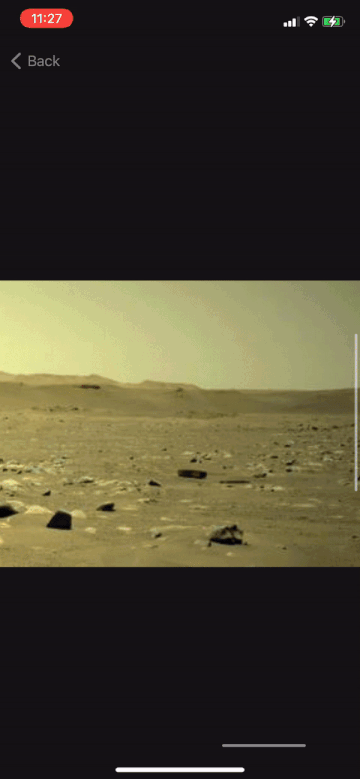

# Quasar
An iOS app that displays various space related feeds:
- NASA's Astronomy Picture of the Day
- Mars Rovers - Perseverance, Opportunity, Curiosity, Spirit
- Hubble Telescope News
- Hubble Live Images - updating snapshots from Hubble observatory
- SpaceX Launches

> Built with SwiftUI and UIKit.

> Uses Kingfisher for asynchronous image loading and caching.

> Utilizes MVVM architecture.

