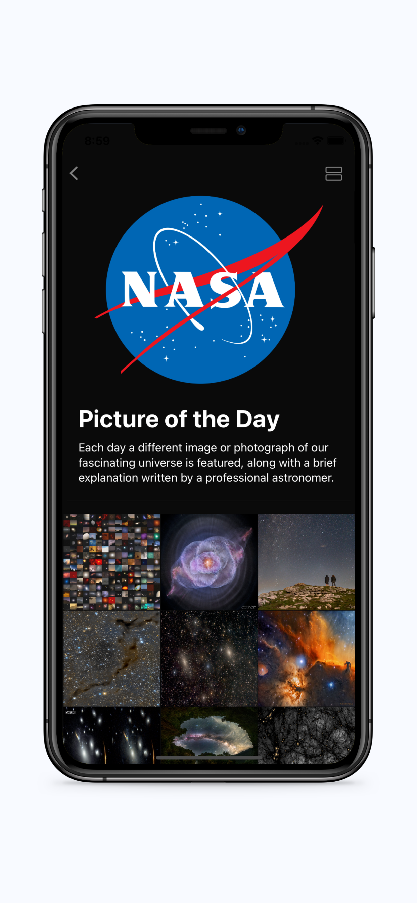

# Saturnine
An iOS app that displays various space related content feeds.
- NASA's Astronomy Picture of the Day
- Mars Rovers - Perseverance, Opportunity, Curiosity, Spirit
- Space related news
- SpaceX rocket launches
- More to come!

> Built with SwiftUI and UIKit.

> Uses Kingfisher for asynchronous image loading and caching.

> Utilizes MVVM architecture.
> 
| |
| :-------------------------:|:-------------------------:|:-------------------------:|
 | |

## Remaining 
- [ ] Alert when user has poor connection
- [ ] Notifications for new photos
- [ ] Trivia game
- [ ] NASA live streams
- [ ] Media feeds (e.g. Twitter, Instagram)

## In the future
- [ ] Rework image magnification, (double tap, pinch to zoom, swipe to return to normal)
- [ ] Implement notifications for Picture of the Day, news articles
- [ ] Implement Updating homepage image buttons
- [ ] Gray-out unavilable rover dates in picker

## Completed
- [X] Redesign homepage UI
- [X] Info modal with privacy/terms/app info
- [X] Refactor horizontal tab paging
- [X] Fix SpaceX sub-tabview remote image bug (images get stuck paging while loading remotely)
- [X] Implement grid vs column page view button
- [X] Save images to photo album
- [X] Share images (email, text, etc)
- [X] Ability to 'favorite' images and view favorited images
- [X] Spacecraft feature
- [X] Astronaut feature
- [X] Expand news feed feature
- [X] Implement TheSpaceDevs API features: ~~spacecraft~~, ~~astronauts~~, ~~space stations~~, ~~events~~
- [X] ~~Implement TheSpaceDevs news api feature~~
- [X] Implement skeleton loader to present before GET request completes
